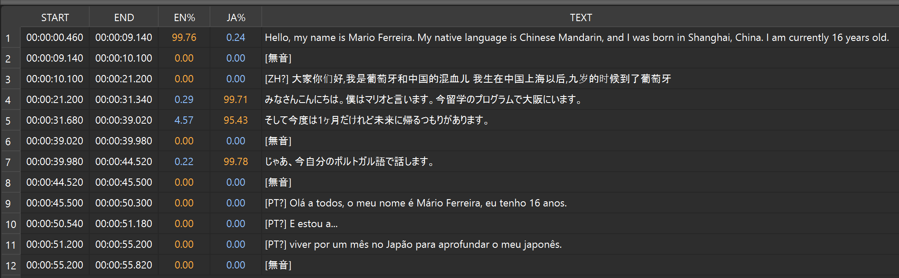

# Multilingual Scriptor

動画・音声ファイルの多言語文字起こしと編集を行うデスクトップアプリケーションです。

Whisper（faster-whisper）を使用して音声認識を行い、最大2言語が混在するコンテンツに対応します。GUI上で再生しながらセグメントの編集（分割・結合・境界調整）ができ、テキストや音声の書き出しが可能です。

---

## 主な機能

- 動画・音声ファイルの自動文字起こし（Whisper large-v3 / distil-large-v3）
- 2言語混在コンテンツの同時認識と言語別確率表示
- 動画再生とセグメントテーブルの連動（クリックでシーク、再生位置に応じた自動選択）
- 複数形式での書き出し（TXT / SRT / JSON）
- 音声書き出し（WAV / MP3）
- VAD（Silero VAD）による音声区間の自動検出

---

## 使用例

以下は本アプリの実使用例です。動画再生に連動して、確認から編集、再解析、書き出しまでの一連の操作をインタラクティブに行えます。

主な操作は次のとおりです：
- セグメントの確認・選択
    - テーブル行をクリックすると該当位置へシークし、再生位置に自動追従します。
- テキスト編集
    - 行ダブルクリックで編集ダイアログを開き、言語ごとのテキストを修正・分割できます。
- セグメント操作
    - 分割／結合／境界移動をGUIで実行し、変更後は部分再文字起こしが自動で実行されます。
- 書き出し・抽出
    - 編集したスクリプトと分割した音声の抽出が行えます。


下の動画は上の操作を実際に行っている様子です。<small>（音声だけの認識です。動画中の字幕情報は使用していません。）</small>
<p align="left">
https://github.com/user-attachments/assets/feee5da1-d80a-4634-8352-6a53fe646c51
</p>


<p align="left">Source: <a href="https://youtu.be/EtEUGILzs2s?si=D5xSs9ZMzx6IIyan">【JP/RU】「起きて！」って日本語とロシア語で？～二カ国語を喋る幼馴染がことわざを言いながら起こしてくる朝～ </a></p> 
<p>Used with permission from <a href="https://www.youtube.com/@kapra_kazami">@kapra_kazami</a>.</p>


---

## 動作環境

- GPU推奨（NVIDIA CUDA または AMD ROCm）
    - CPUでも動作しますが、文字起こし速度が大幅に低下します。

## インストール

### 1. GPU環境（推奨）

[CUDA Toolkit](https://developer.nvidia.com/cuda-downloads)をインストール

**AMD GPU:**
[ROCm SDK](https://www.amd.com/en/developer/resources/rocm-hub/hip-sdk.html)をインストール

詳細は[CTranslate2のドキュメント](https://github.com/OpenNMT/CTranslate2)を参照してください。

### 2. リポジトリのクローン

```pwsh
git clone https://github.com/qwertyuichi/multilingual_scriptor.git
cd multilingual_scriptor
```

### 3. Python環境のセットアップ

Windows（PowerShell使用）:

```pwsh
python -m venv venv
.\venv\Scripts\Activate.ps1
python -m pip install --upgrade pip
pip install -r requirements.txt
```

### 4. FFmpegのインストール

Windows（winget使用）:

```pwsh
winget install ffmpeg
```

インストール後、新しいターミナルでPATHが通っているか確認：

```pwsh
ffmpeg -version
```

**その他の方法:**
- [FFmpeg公式サイト](https://ffmpeg.org/download.html)からダウンロード
- Chocolatey: `choco install ffmpeg`
- Scoop: `scoop install ffmpeg`

---

## 起動

```pwsh
python main.py
```

初回起動時は `config.toml` の `[default]` セクションの設定が読み込まれます。

---

## 基本的な使い方

### 1. 動画ファイルを開く

「動画を開く」ボタンで動画・音声ファイルを選択します。

### 2. 文字起こしの実行

1. 言語を選択（最大2言語）
2. モデルとデバイス（CPU/CUDA）を選択
3. 「文字起こし開始」ボタンをクリック

処理中はセグメントが順次テーブルに追加されます。

### 3. 再生と確認

- 再生ボタンで動画を再生
- テーブルの行をクリックするとその位置にシーク
- 再生位置に応じてテーブルの選択が自動で移動

### 4. セグメントの編集

**テキストの修正:**
- 行をダブルクリックして編集ダイアログを開く
- 言語を切り替えてテキストを修正

**セグメントの分割:**
- 1行を選択して再生位置を調整
- 「分割」ボタンで現在位置で分割
- 分割後、自動的に再文字起こしが実行される

**境界の調整:**
- 連続する2行を選択して再生位置を調整
- 「境界調整」ボタンで境界を移動
- 調整後、自動的に再文字起こしが実行される

**セグメントの削除:**
- 行を選択して「削除」ボタンをクリック

### 5. 書き出し

**テキスト書き出し:**
1. 書き出し形式を選択（TXT / SRT / JSON）
2. 「テキスト書き出し」ボタンをクリック
3. 保存先を指定

**音声書き出し:**
1. 形式を選択（WAV / MP3）
2. 「音声書き出し」ボタンをクリック
3. 保存先を指定

---

## 書き出し形式

### TXT形式

タイムスタンプと言語確率を含むプレーンテキスト形式：

```
[HH:MM:SS.mmm -> HH:MM:SS.mmm] [JA:xx.xx%] [RU:yy.yy%] JA=テキスト1 | RU=テキスト2
```

### SRT形式

字幕ファイル標準形式。優勢言語（確率が高い方）のテキストを出力：

```
1
00:00:00,000 --> 00:00:05,000
テキスト内容
```

### JSON形式

全セグメント情報を含む構造化データ：

```json
{
  "segments": [
    {
      "start": 0.0,
      "end": 5.0,
      "text": "表示テキスト",
      "text_lang1": "言語1テキスト",
      "text_lang2": "言語2テキスト",
      "lang1_prob": 85.5,
      "lang2_prob": 14.5,
      "lang1_code": "ja",
      "lang2_code": "en",
      "chosen_language": "ja"
    }
  ],
  "metadata": { ... }
}
```

---

## 設定ファイル

`config.toml` で各種パラメータを設定できます。

### 基本設定例

```toml
[default]
device = "cuda"                    # cpu / cuda
model = "large-v3"                 # large-v3 / distil-large-v3
default_languages = ["ja", "en"]   # 起動時に選択する言語

lang1_weight = 0.50                # 言語1スコアの補正係数
lang2_weight = 0.50                # 言語2スコアの補正係数

no_speech_threshold = 0.6          # 無音スキップ感度（0〜1）
initial_prompt = ""                # 認識ヒント（固有名詞など）

# VAD設定
vad_filter = true                  # 音声区間の自動検出
vad_threshold = 0.5                # 音声判定の閾値
vad_min_speech_ms = 250            # 最小発話長
vad_min_silence_ms = 2000          # セグメント区切りとする無音長
```

### プロファイルの追加

複数の設定を切り替えて使用できます：

```toml
[custom_profile]
device = "cuda"
model = "large-v3"
default_languages = ["ja", "ru"]
lang1_weight = 0.4
lang2_weight = 0.6
vad_min_silence_ms = 500           # より短い無音で区切る
```

GUIからプロファイルを選択して切り替えられます。

### 高度な設定

GUI右下の「高度な設定...」ボタンから、以下を調整できます。：

- 言語判定設定
    - beam_sizeを調整することで、文字認識の精度と速度のバランスを調整できます。
    - (値が大きいほど精度は向上するが処理時間がかかる)
- 言語候補
    - デフォルトで候補に表示されない言語はこちらで有効化できます。
- ログ設定
    - ログの出力設定ができます。（デバッグ用）
- その他
    - 文字起こしのより細かい内部パラメータを調整することができます。（デバッグ用）

いずれも、通常は変更する必要はありません。

---

## 言語選択の注意事項

多言語に対応していますが、組み合わせによっては精度が低下する場合があります。


**言語体系が異なる言語ペアは高精度で動作します：**
- 日本語 + ロシア語
- 日本語 + 英語

など。


**注意が必要な組み合わせ：**

- 英語 + フランス語
- ロシア語 + ウクライナ語

など。これらの組み合わせでは、類似の音響特徴と語彙を共有するため、精度が低下します。

**対策:**
- 言語設定の重みを調整することで、精度向上が見込めます。

---

## 複数言語（3言語以上）について

本ツールは内部で複数言語の確率を扱えますが、3言語以上が同一音声に混在する場合の自動判別は難しく、実運用で高い精度は期待できません。
認識は可能ですが、短い発話や類似音が多い箇所で誤認識が増える点について留意してください。

以下は４言語混在例のスクリーンショットです。


<p align="left">
  
</p>

<p align="left"><small>使用した動画: <a href="https://wikitongues.org/videos/mario_20161021_eng-cmn-jpn-por/">Wikitongues — Mario speaking English, Mandarin, Japanese, and Portuguese</a></small></p>

- このテストでは英語（EN）と日本語（JA）に加えて、中国語（ZH）とポルトガル語（PT）も認識しています。
- 指定していない言語が検出される場合、出力スクリプトの先頭に `[ZH?]`, `[PT?]` のような疑問付きの言語タグが自動付与されます（例: `[ZH?] 大家你`）。
- 実運用ではこれらのタグを手動確認して、必要に応じて表示言語を切り替えるかポストエディットしてください。


## トラブルシューティング

### CTranslate2のDLL読み込みエラー

**症状:**
```
FileNotFoundError: Could not find module 'ctranslate2.dll'
```

**原因:**
GPU用のランタイムライブラリが不足しています。

**対処法:**

NVIDIA GPU使用時：
- [CUDA Toolkit](https://developer.nvidia.com/cuda-downloads)をインストール

AMD GPU使用時：
- [ROCm SDK](https://www.amd.com/en/developer/resources/rocm-hub/hip-sdk.html)をインストール


インストール後はシステムを再起動してください。

### FFmpegが見つからない

**症状:**
FFmpeg関連のエラーが表示される。

**対処法:**
1. FFmpegをインストール（上記参照）
2. ターミナルを再起動
3. `ffmpeg -version` で確認

### GPUが使用されない

**対処法:**
1. GPUドライバを最新版に更新
2. CUDA/ROCmが正しくインストールされているか確認
3. `config.toml` で `device = "cuda"` が設定されているか確認

### 処理が遅い

**対処法:**
- GPUを使用する（CPU使用時は非常に遅い）
- より小さいモデルを選択（`distil-large-v3`）
- VAD設定を調整して無音部分をスキップ

### 文字化けが発生する

**対処法:**
- テキストエディタでUTF-8（BOM無し）として開く
- Windowsのメモ帳以外のエディタを使用

---

## ログ機能

詳細なログを記録する場合は、`config.toml` に以下を追加：

```toml
[logging]
level = "INFO"              # DEBUG / INFO / WARNING / ERROR / CRITICAL
file_enabled = true         # ファイル出力を有効化
file_path = "app.log"       # ログファイルのパス
max_bytes = 1048576         # ローテーションサイズ（バイト）
backup_count = 3            # 保持する世代数
```

デバッグ時のみ `level = "DEBUG"` に設定してください。

---

## 開発者向け情報

内部アーキテクチャ、データ構造、モジュール構成については [CONTRIBUTING.md](CONTRIBUTING.md) を参照してください。

---

## ライセンス

- faster-whisper: MIT License (https://github.com/SYSTRAN/faster-whisper)
- 

---

## フィードバック

ご要望や改善案がありましたら、Issueまたはコメントでお知らせください。
